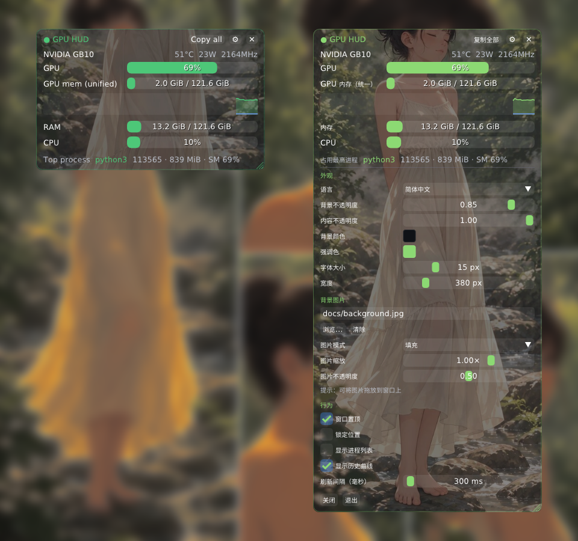

# GPU HUD

A small always-on-top, see-through GPU monitor for Linux. Built with Dear ImGui, GLFW and OpenGL 3.3, in C++17.



- GPU utilization, VRAM, temperature, power and clock, with a history graph for each GPU
- System RAM, CPU and swap
- The top GPU process, plus a sortable list of GPU processes (click the Mem or SM column header)
- **Copy all** puts a full report on the clipboard: live metrics, OS, CPU, memory, motherboard/BIOS, GPU driver/CUDA/PCI/UUID, displays and storage
- 10 UI languages, all UTF-8: English, 简体中文, 繁體中文, 日本語, 한국어, Español, Français, Deutsch, Русский, Português. The CJK font is picked per language through fontconfig, and you can switch languages without restarting.
- Separate sliders for background opacity and content opacity, plus background and accent colors
- Background image modes: tile, stretch, fill or center, with adjustable scale and opacity. You can drag and drop an image onto the window.
- Frameless window: drag it to move, drag the bottom-right corner to change the width. The height fits the content automatically. Position can be locked.

GPU support:
- **NVIDIA**: uses NVML, loaded at runtime (`libnvidia-ml.so.1`), so there is no build-time CUDA dependency.
- **AMD**: reads amdgpu sysfs.
- **Unified-memory GPUs** (DGX Spark / GB10, Jetson, APUs): shown as "GPU mem (unified)". Used memory is the sum of per-process GPU memory, and the total is system RAM.

## Build

```bash
./build.sh
```

`build.sh` fetches pinned ImGui/GLFW/stb sources into `third_party/`. If the X11/GL `-dev` headers are missing, it downloads them locally without root (`scripts/bootstrap-headers.sh`). The binary links only libc and libstdc++, and loads X11, GL and NVML at runtime.

If you prefer system packages:
```bash
sudo apt install cmake g++ libx11-dev libxrandr-dev libxinerama-dev libxcursor-dev libxi-dev libgl-dev libxkbcommon-dev
```

## Run

```bash
./build/gpu-hud
```

| Action | How |
|---|---|
| Move | Drag anywhere that isn't a control |
| Resize width | Drag the bottom-right corner |
| Settings | ⚙ button or right-click |
| Copy report | **Copy all** button |
| Background image | Settings → Browse… (zenity/kdialog), type a path, or drag and drop a file |
| Print report to stdout | `gpu-hud --report` |
| Ignore saved settings | `gpu-hud --reset` |
| Save the window as a PNG (with alpha) | `gpu-hud --screenshot out.png --delay 8` |

Settings are saved to `~/.config/gpu-hud/config.ini`.

Install to `~/.local` (binary plus desktop entry):
```bash
cmake --install build --prefix ~/.local
```

## Notes

- For real transparency you need a compositing window manager. GNOME, KDE and most modern desktops have one. Without it, the background is drawn opaque.
- Wayland has no protocol for always-on-top or for a window positioning itself, so the app runs through XWayland (the X11 backend) on purpose.
- The code is split into `metrics.cpp` (NVML/sysfs/procfs sampling in a background thread), `sysinfo.cpp` (hardware inventory), `i18n.cpp` (translations) and `main.cpp` (UI). This keeps the Linux-specific parts separate for future Windows/macOS ports.

## License

GPL-3.0-or-later. See [LICENSE](LICENSE). The third-party libraries (Dear ImGui: MIT, GLFW: zlib, stb: public domain/MIT) are fetched at build time and keep their own licenses.
